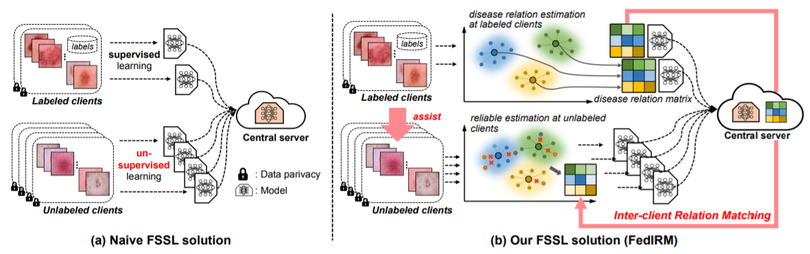

# Federated Semi-supervised Medical Image Classification via Inter-client Relation Matching
by [Quande Liu](https://github.com/liuquande), [Hongzheng Yang](https://github.com/HongZhengYang), [Qi Dou](http://www.cse.cuhk.edu.hk/~qdou/), [Pheng-Ann Heng](http://www.cse.cuhk.edu.hk/~pheng/).

Edited by [Muhammed Said Ozdemir](https://github.com/msoz7) and [Mais Sabbagh](https://github.com/MaisSabbagh)

## Introduction

Improved Pytorch implementation for MICCAI 2021 paper "Federated Semi-supervised Medical Image Classification via Inter-client Relation Matching"

## Prepare the repository and datasets
1. Clone the repository and go to the repository root directory:

       git clone https://github.com/msoz7/FedIRM.git
       cd FedIRM

2. Create a conda environment with python 3.10 and and install all the dependencies:

       conda create --name FedIRM python=3.10
       conda activate FedIRM
       pip install scikit-learn==1.2.2 pandas imblearn matplotlib timm openpyxl numpy==1.23.5

4. Download datasets from following sources:
   1. [ISIC 2019 (Kaggle)](https://www.kaggle.com/datasets/andrewmvd/isic-2019)
   2. [HAM10000 (Kaggle)](https://www.kaggle.com/kmader/skin-cancer-mnist-ham10000)
   3. [RSNA Intracranial Hemorrhage Detection (drive)](https://drive.google.com/drive/folders/1bhe_0KvdxEli7-6ZrQ9ahaDPpSnvF4UW?usp=share_link)

5. Extract the datasets to `data/` folder and place the content into folders like this:
   1. ISIC 2019: `data/isic2019/`
   2. HAM10000: `data/ham10000/`
   3. RSNA Intracranial Hemorrhage Detection: `data/rsna/`

6. Go to data folder from terminal with `cd data` and run `python prepare_data.py` to prepare the datasets.

## Run the code
1. Go to the `src` folder with `cd src` and run `python main.py` to train the model.

2. You can see the different options in `src/options.py` and change the parameters as you want.

3. You can see the example run commands in `src/example_run.sh` file.

## Refrence
    @article{liu2021federated,
      title={Federated Semi-supervised Medical Image Classification via Inter-client Relation Matching},
      author={Liu, Quande and Yang, Hongzheng and Dou, Qi and Heng, Pheng-Ann},
      journal={International Conference on Medical Image Computing and Computer Assisted Intervention},
      year={2021}
    }

### Questions

If you have questions about this version of the code, you can also contact 'mohammedozdamir@gmail.com' or 'mais.sabbagh23@gmail.com'
